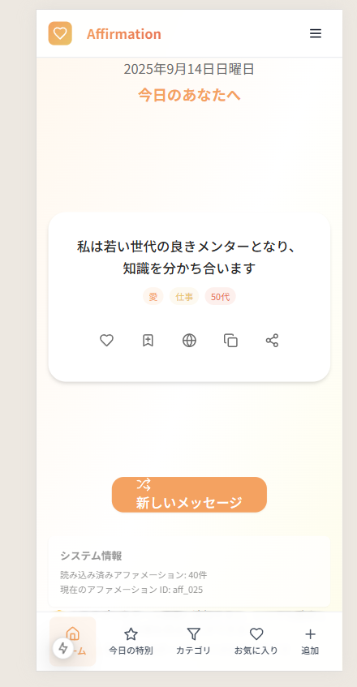

# Daily Affirmation - 日々のアファメーション

<!-- 画像をここに挿入予定 -->


## 📱 アプリ概要

Daily Affirmationは、あなたの心を支える毎日のアファメーション（肯定的宣言）を提供するPWAアプリです。年代別・シーン別に最適化された励ましの言葉で、ポジティブな気持ちを育みます。

### ✨ 主な特徴

- 🎯 **パーソナライズ**: 年代・シーン・テーマに応じたアファメーション
- 🌙 **ダークモード**: 寝る前の利用に配慮した目に優しいデザイン
- 📱 **PWA対応**: ホーム画面に追加してネイティブアプリのように利用可能
- 💾 **オフライン対応**: インターネット接続なしでも全機能利用可能
- 🎨 **レスポンシブ**: スマートフォン・タブレット・PC全てに最適化

## 🚀 機能一覧

### メイン機能
- **ランダムアファメーション表示**: 今の気分に合った言葉をランダムで表示
- **今日の特別なメッセージ**: ユーザーの好みを分析して特別なメッセージを提供
- **カテゴリ別検索**: テーマ・シーン・年代でフィルタリング
- **お気に入り機能**: 気に入った言葉を保存・管理
- **ユーザー投稿**: 自分だけのアファメーションを追加

### カテゴリ
- **テーマ**: 自信・愛・成功・健康・平和・成長・感謝・希望
- **シーン**: 朝・夜・仕事・移動・休息・困難・一般
- **年代**: 20代〜60代、全年代向け

## 🛠️ 技術仕様

### フロントエンド
- **Next.js 15**: App Router + Server Components
- **TypeScript**: 型安全な開発
- **Tailwind CSS v3**: ユーティリティファーストCSS
- **Framer Motion**: 滑らかなアニメーション

### PWA機能
- **Service Worker**: オフラインキャッシュ
- **Web App Manifest**: ホーム画面追加対応
- **レスポンシブデザイン**: 全デバイス対応

### 状態管理
- **React Context**: グローバル状態管理
- **LocalStorage**: データ永続化
- **カスタムフック**: 再利用可能なロジック

## 📊 データ構造

### アファメーション
```typescript
interface Affirmation {
  id: string
  text: string
  textEn?: string
  categories: {
    theme: ThemeCategory
    scene: SceneCategory
    ageGroup: AgeGroup
  }
  author?: string
  source?: string
  tags: string[]
  createdAt: string
  isUserGenerated: boolean
}
```

### 収録データ
- **40+のアファメーション**: 質の高い励ましの言葉を厳選
- **多言語対応**: 英語原文付きで深く理解
- **著名人格言**: ドクター・ディマティーニ等の名言を収録

## 🎨 デザインシステム

### カラーパレット
- **ライトモード**: 温かみのある癒し系（オレンジ・イエロー系）
- **ダークモード**: 目に優しいダークグレー系
- **アクセント**: プライマリ・セカンダリ・アクセントカラー

### レスポンシブブレークポイント
- **Mobile**: 〜639px
- **Tablet**: 640px〜1023px
- **Desktop**: 1024px〜

## 🚀 セットアップ

### 必要環境
- Node.js 18.17以上
- npm または yarn

### インストール
```bash
# リポジトリをクローン
git clone https://github.com/takamiya1021/app017-affirmation.git
cd app017-affirmation

# 依存関係をインストール
npm install

# 開発サーバーを起動
npm run dev
```

### 利用可能なコマンド
```bash
npm run dev          # 開発サーバー起動
npm run build        # プロダクションビルド
npm run start        # プロダクションサーバー起動
npm run lint         # ESLint実行
npm run type-check   # TypeScript型チェック
```

## 📁 プロジェクト構造

```
app017-affirmation/
├── doc/                          # ドキュメント
│   ├── requirements.md           # 要件定義書
│   ├── technical-design.md       # 技術設計書
│   └── implementation-plan.md    # 実装計画書
├── public/                       # 静的ファイル
│   ├── data/
│   │   └── affirmations.json     # アファメーションデータ
│   ├── icons/                    # PWAアイコン
│   └── manifest.json             # PWAマニフェスト
├── src/
│   ├── app/                      # Next.js App Router
│   │   ├── categories/           # カテゴリページ
│   │   ├── favorites/            # お気に入りページ
│   │   ├── add-affirmation/      # 投稿ページ
│   │   ├── settings/             # 設定ページ
│   │   └── daily-special/        # 特別なメッセージ
│   ├── components/               # Reactコンポーネント
│   │   ├── ui/                   # UIコンポーネント
│   │   ├── affirmation/          # アファメーション関連
│   │   └── layout/               # レイアウト
│   ├── context/                  # React Context
│   ├── lib/                      # ユーティリティ・サービス
│   └── types/                    # TypeScript型定義
└── screenshots/                  # アプリスクリーンショット
```

## 📱 PWA機能

### インストール方法
1. **Chrome/Edge**: アドレスバーのインストールアイコンをクリック
2. **Safari**: 共有ボタン → "ホーム画面に追加"
3. **Android**: Chrome メニュー → "ホーム画面に追加"

### オフライン機能
- 全アファメーションデータをローカルキャッシュ
- UI・画像リソースをService Workerでキャッシュ
- ネットワーク接続なしでも全機能利用可能

## 🎯 使用方法

### 基本的な使い方
1. **ホーム画面**: ランダムなアファメーションを表示
2. **新しいメッセージ**: シャッフルボタンで新しい言葉を取得
3. **カテゴリ**: テーマ・シーン・年代で絞り込み検索
4. **お気に入り**: ハートボタンで言葉を保存
5. **設定**: テーマ・年代・ダークモード設定

### 効果的な活用法
- **朝**: 1日の始まりに前向きな気持ちで
- **通勤中**: オフライン機能でいつでも利用
- **就寝前**: ダークモードで目に優しく
- **困難な時**: カテゴリ検索で適切な励ましを

## 🔧 カスタマイズ

### アファメーション追加
アプリ内の「アファメーション追加」ページから新しい言葉を投稿できます。

### テーマ設定
- ライト・ダークモード切り替え
- 年代設定による最適化
- システム設定連動

## 🤝 貢献

### 開発に参加
1. フォークしてください
2. フィーチャーブランチを作成 (`git checkout -b feature/amazing-feature`)
3. 変更をコミット (`git commit -m 'Add amazing feature'`)
4. ブランチにプッシュ (`git push origin feature/amazing-feature`)
5. プルリクエストを作成

### 課題報告
バグや改善提案は[Issues](https://github.com/takamiya1021/app017-affirmation/issues)までお気軽に。

## 📄 ライセンス

このプロジェクトはMITライセンスの下で公開されています。詳細は[LICENSE](./LICENSE)をご覧ください。

## 🙏 謝辞

- アファメーション提供者の皆様
- オープンソースライブラリの開発者の皆様
- ベータテスト協力者の皆様

---

**Daily Affirmation** - あなたの心を支える、毎日のポジティブな言葉 ✨